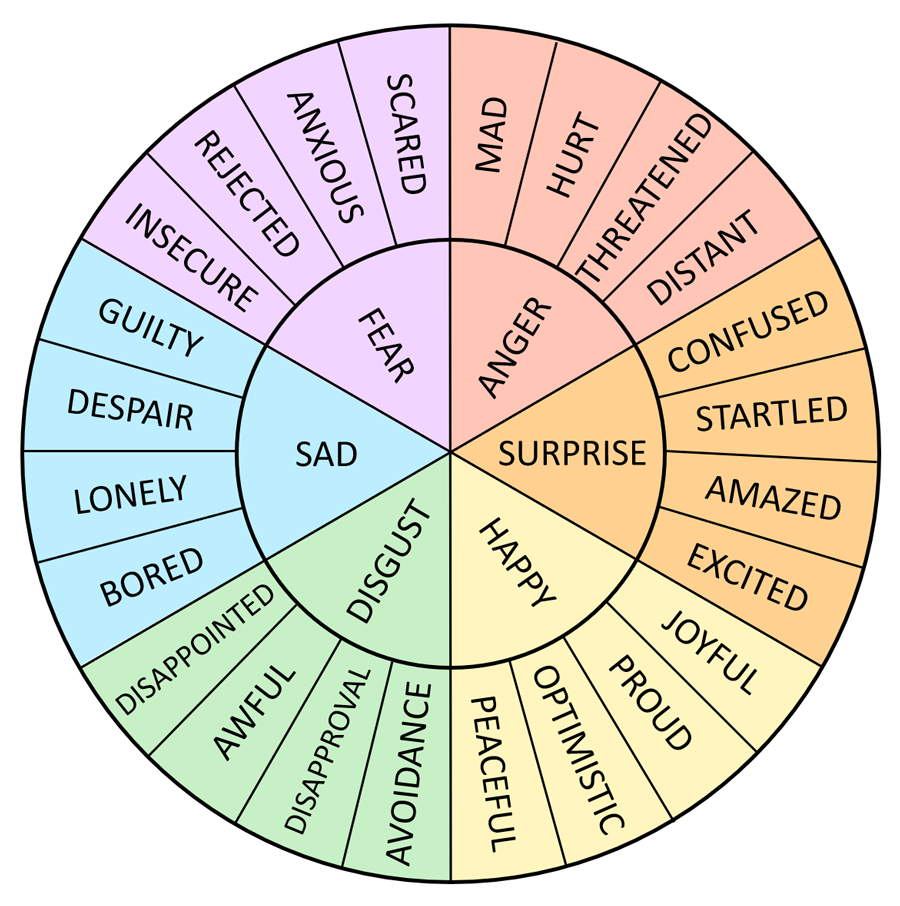

# Customer-Call-Emotion-Recognition-with-Speaker-Diarization

Emotion is a complex topic, and its study spans multiple disciplines. The importance of human speech emotion recognition has grown in recent years to improve both the naturalness and efficiency of human-machine interactions. Research on speech emotion recognition (SER) has also gained popularity through the use of machine learning techniques.

Among all kind of emotions, six categories are often described as the cardinal ones: **happy, disgust, sad, fear, anger, suprise**.

    

Taking audio files labelled as `happy`,`disgust`,`sad`,`fear`,`anger`,`surprise`, and `neutral`, this project aim to build and evaluate few models to classify these sounds.

 

The entire project is made into 2 parts:

## Part A: 
Find the best perfomring model for emotion recognition of single speaker audio clips
The project is structured in nine jupyter notebooks with these parts:
1. **The data Merging Step**: information on sources used and preliminary overview of the samples
2. **Data cleaning + feature extraction**: audio processing for cleaning the samples (resampling, trimming, noise reduction) and description of extracted features
3. **Random Forest**: getting the best hyperparameters (number of decision trees and their maximum depth) with cross validation
4. **Support Vector Machine**: tuning and evaluating the regularization strenght parameter C and the gamma value for an rbf kernel
5. **Dense Networks**: fitting two models, one without hidden layers and the other with two hidden layers
6. **Convolutional Netural Network**: training a Conv Net with MFCC data as two-dimensional arrays instead of using the features
7. **Models performance comparison**: evaluation of model performance with visualizations and final considerations on the project

ML model Details:

Random Forest:  

Hyperparameter Heatmap and Graph for choosing the best hyperparameters.
- By tuning the hyperparameters, we can achieve the best performance of the Random Forest model on the new and unseen data.
- It can be seen that increasing the number of trees helps, as at each depth the best score always has the highest value, 300. The heatmap also suggests that increasing the depth of trees seems to improve the overall model but we see that after a value of 50 the score doesn’t improve.
- The best hyperparameters for this random forest model are 300 trees with a depth of 25.

Test accuracy for the random forest model after the tuning: 0.912

Support Vector Machine:

Hyperparameter Heatmap and Graph for choosing the best hyperparameters.
- By tuning the hyperparameters, we can achieve the best performance of the SVM model on the new and unseen data.
- The Support Vector Machine model with the RBF kernel yielded optimal results when tuned with a regularization strength (C) of 100 and a gamma value of 0.01.
-  Interestingly, employing a gamma value of 1 led to a significant decrease in model accuracy, while using a C value below 0.1 also resulted in a noticeable decline in performance.

The SVC classifier with the RBF kernel achieved outstanding results, exhibiting a remarkable test accuracy of 0.961.

Convolutional Neural Network:

Convolutional Neural Network Accuracy Loss Graphs

Convolutional Neural Network Confusion Matrix

- The CNN model achieved promising results with a test loss of 0.31, indicating a relatively low level of error. 
- The model demonstrated an impressive test accuracy of 88.49%.

**After comparing all the models we find the best performing model is SVM (Support Vector Machine).**

## Part B: 
Split real life audio clip with multiple speakers (usually 2 in a customer call) using speaker diarization method

For a deep dive into the project, here is a detailed report of it : https://drive.google.com/file/d/11L781JGAcg7G-HHQt8C2gCD0hM9n7Z3L/view?usp=sharing
